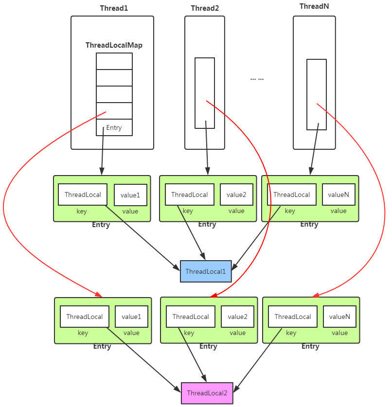
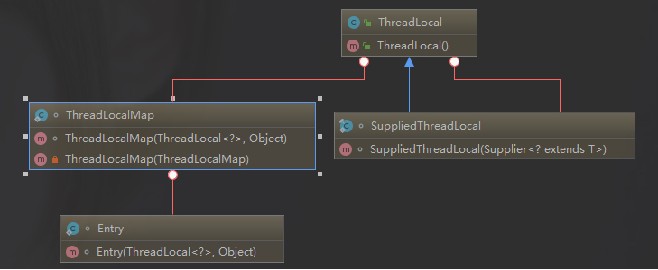

# Java并发知识

### 1 Volatile关键字

#### 1.1 Java内存模型

在`JDK1.2`之前，Java的内存模型实现总是从**主存**(即共享内存)读取变量，是不需要进行特别的注意的。而在当前的Java内存模型下，线程可以把变量保存**本地内存**(比如机器的寄存器)中，而不是直接在主存中进行读写。这就可能造成一个线程在内存中修改了一个变量的值，而另外一个线程还继续使用它在寄存器中的变量值的拷贝，造成**数据的不一致**。


要解决这个问题，就需要把变量声明为volatile，这就指示JVM，这个变量是不稳定的，每次使用它都到主存中进行读取。说白了，**volatile关键字的主要作用就是保证变量的可见性然后还有一个作用是防止指令重排序**。


#### 2.2 并发编程的三个重要特性

1. 原子性：一个的操作或者多次操作，要么所有操作全部都得到执行并且不会收到任何因素的干扰而中断，要么所有的操作都执行，要么都不执行。`synchronized`可以保证代码片段的原子性。
2. 可见性：当一个变量对共享变量进行了修改，要么另外的线程都是立即可以看到修改后的最新值。`volatile`关键字可以保证共享变量的可见性。
3. 有序性：代码在执行的过程中的先后顺序，Java在编译器以及运行期间的优化，代码的执行顺序未必就是编写代码时候的顺序。`volatile`关键字可以禁止指令进行重排序优化。

#### 2.3  `synchronized`关键字和`volatile`关键字的区别

`synchronized`关键字和`volatile`关键字是两个互补的存在，而不是对立的存在：

- **volatile关键字是线程同步的轻量级实现**，所以volatile性能肯定比synchronized关键字要好。但是**volatile关键字只能用于变量而synchronized关键字可以修饰方法以及代码块**。synchronized关键字在`JavaSE1.6`之后进行了主要包括为了减少获得锁和释放锁带来的性能消耗而引入的偏向锁和轻量级锁以及其它各种优化之后效率有了显著提升，**实际开发中使用synchronized关键字的场景还是会更多一点**。
- **多线程访问volatile关键字不会发生阻塞，而synchronized关键字可能会发生阻塞。**
- **volatile关键字能保证数据的可见性，但不能保证数据的原子性。synchronized关键字两者都能保证。**
- **volatile关键字主要用于解决变量在多个线程之间的可见性，而synchronized关键字解决的是多线程之间访问资源的同步性。**

### 2  `ThreadLoacl`

#### 2.1 `ThreadLoacl`简介

通常情况下，我们创建的变量是可以被任何一个线程访问并修改的。如果想实现每一个线程都有自己的专属本地变量该如何解决呢？`JDK`中提供的`ThreadLoacl`类正是为了解决这样的问题。`ThreadLoacl`类主要解决的就是让每个线程绑定自己的值，可以将`ThreadLoacl`类形象的比喻成存放数据的盒子，盒子中可以存储每个线程的私有数据。

**如果你创建了一个`ThreadLoacl`变量，那么访问这个变量的每个线程都会有这个变量的本地副本，这也是`ThreadLoacl`变量名的由来。他们可以使用`get()`和`set()`方法来获取默认值或将其值更改为当前线程所存的副本的值，从而避免了线程安全问题。**

再举个简单例子：

比如有两个人去宝屋收集宝物，这两个共用一个袋子的话肯定会产生争执，但是给他们两个人每个人分配一个袋子的话就不会出现这样的问题。如果把这两人比作线程的话，那么`ThreadLoacl`就是用来避免这两个线程竞争的。

#### 2.2  `ThreadLoacl`示例

```java
public class ThreadLocalExample implements Runnable{

     // SimpleDateFormat 不是线程安全的，所以每个线程都要有自己独立的副本
    private static final ThreadLocal<SimpleDateFormat> formatter = ThreadLocal.withInitial(() -> new SimpleDateFormat("yyyyMMdd HHmm"));
    
    /*private static final ThreadLocal<SimpleDateFormat> formatter = new ThreadLocal<SimpleDateFormat>(){
        @Override
        protected SimpleDateFormat initialValue()
        {
            return new SimpleDateFormat("yyyyMMdd HHmm");
        }
    };*/

    public static void main(String[] args) throws InterruptedException {
        ThreadLocalExample obj = new ThreadLocalExample();
        for(int i=0 ; i<10; i++){
            Thread t = new Thread(obj, ""+i);
            Thread.sleep(new Random().nextInt(1000));
            t.start();
        }
    }

    @Override
    public void run() {
        System.out.println("Thread Name= "+Thread.currentThread().getName()+" default Formatter = "+formatter.get().toPattern());
        try {
            Thread.sleep(new Random().nextInt(1000));
        } catch (InterruptedException e) {
            e.printStackTrace();
        }
        //formatter pattern is changed here by thread, but it won't reflect to other threads
        formatter.set(new SimpleDateFormat());

        System.out.println("Thread Name= "+Thread.currentThread().getName()+" formatter = "+formatter.get().toPattern());
    }

}
```

运行结果：

```java
Thread Name= 0 default Formatter = yyyyMMdd HHmm
Thread Name= 0 formatter = yy-M-d ah:mm
Thread Name= 1 default Formatter = yyyyMMdd HHmm
Thread Name= 2 default Formatter = yyyyMMdd HHmm
Thread Name= 1 formatter = yy-M-d ah:mm
Thread Name= 3 default Formatter = yyyyMMdd HHmm
Thread Name= 2 formatter = yy-M-d ah:mm
Thread Name= 4 default Formatter = yyyyMMdd HHmm
Thread Name= 3 formatter = yy-M-d ah:mm
Thread Name= 4 formatter = yy-M-d ah:mm
Thread Name= 5 default Formatter = yyyyMMdd HHmm
Thread Name= 5 formatter = yy-M-d ah:mm
Thread Name= 6 default Formatter = yyyyMMdd HHmm
Thread Name= 6 formatter = yy-M-d ah:mm
Thread Name= 7 default Formatter = yyyyMMdd HHmm
Thread Name= 7 formatter = yy-M-d ah:mm
Thread Name= 8 default Formatter = yyyyMMdd HHmm
Thread Name= 9 default Formatter = yyyyMMdd HHmm
Thread Name= 8 formatter = yy-M-d ah:mm
Thread Name= 9 formatter = yy-M-d ah:mm
```

从输出中可以看出，Thread-0已经改变了formatter的值，但仍然是thread-2默认格式化程序与初始化值相同，其他线程也一样。

#### 2.3 `ThreadLocal`原理

从Thread类源码开始：

```java
public class Thread implements Runnable {
 ......
//与此线程有关的ThreadLocal值。由ThreadLocal类维护
ThreadLocal.ThreadLocalMap threadLocals = null;

//与此线程有关的InheritableThreadLocal值。由InheritableThreadLocal类维护
ThreadLocal.ThreadLocalMap inheritableThreadLocals = null;
 ......
}
```

从上面Thread类源代码可以看出Thread类中有一个`threadLoacls`和一个`inheritableThreadLocals`变量，它们都是`ThreadLocalMap`类型的变量，我们可以把`ThreadLocalMap`理解为`ThreadLoacl`类实现的定制化的`HashMap`。默认情况下这两个变量都是null，只有当前线程调用`ThreadLoacl`类的`set`或`get`方法时才创建它们，实际上调用这两个方法的时候，我们调用的是`ThreadLoaclMap`类对应的`get()`，`set()`方法。

`ThreadLocal`类的`set()`方法

```java
 public void set(T value) {
        Thread t = Thread.currentThread();
        ThreadLocalMap map = getMap(t);
        if (map != null)
            map.set(this, value);
        else
            createMap(t, value);
    }
    ThreadLocalMap getMap(Thread t) {
        return t.threadLocals;
    }
```

通过上面这些内容，我们足以通过猜测得出结论：**最终的变量是放在了当前线程的`ThreadMap`中，并不是存在`ThreadLoacl`上，`ThreadLocal`可以理解为只是`ThreadLoaclMap`的封装，传递了变量值。**`ThreadLoacl`类中可以通过`Thread.currentThread()`获取到当前线程对象后，直接通过`getMap(Thread t)`可以访问到该线程的`ThreadLoaclMap`对象。

**每个Thread中具备一个`ThreadLocalMap`，而`ThreadLoaclMap`可以存储以`ThreadLoacl`为key，Object对象为value的键值对。**

```java
ThreadLocalMap(ThreadLocal<?> firstKey, Object firstValue) {
 ......
}
```

比如我们在同一个线程中声明了两个`ThreadLoacl`对象的话，在`Thread`内部都是使用仅有那个`ThreadLocalMap`存放数据的，`ThreadLocalMap`的key就是对象，value就是`ThreadLoacl`对象调用set方法设置的值。



`ThreadLocalMap`是`ThreadLocal`的静态内部类。



#### 2.4 `ThreadLocal`内存泄漏问题

`ThreadLocalMap`中使用的key为`ThreadLocal`的弱引用，而value是强引用。所以如果`ThreadLocal`没有被外部强引用的情况下，在垃圾回收的时候，key会被清理掉，而value不会被清理掉。这样一来，`ThreadLoaclMap`中就会出现key为null的Entry。假如我们不做任何措施的话，value永远无法被GC回收，这个时候就可能会产生内存泄漏。`ThreadLocalMap`实现中已经考虑了这种情况，在调用`set()`，`get()`，`remove()`方法的时候，会清理掉key为null的记录。使用完`ThreadLocal`方法后最好手动调用`remove()`方法。

```java
static class Entry extends WeakReference<ThreadLocal<?>> {
    /** The value associated with this ThreadLocal. */
    Object value;

    Entry(ThreadLocal<?> k, Object v) {
        super(k);
        value = v;
    }
}
```

### 3 Atomic原子类

#### 3.1 介绍一下Atomic原子类

Atomic翻译成中文是原子的意思。在化学上，我们知道原子是构成一般物质的最小单位，在化学反应中是不可分割的。在我们这里Atomic是指一个操作是不可中断的。即使是在多线程一起执行的时候，一个操作一旦开始，就不会被其他线程干扰。

所以，所谓原子类就是具有原子/原子操作特征的类。

并发包`java.util.concurrent`的原子类都存放在`java.util.concurrent.atomic`下，


#### 3.2 `JUC`包中的原子类

1. **基本类型**

   使用原子的方式更新基本类型

   - `AtomicInteger`：整型原子类。
   - `AtomicLong`：长整型原子类。
   - `AtomicBoolean`：布尔型原子类。

2. **数组类型**

   使用原子的方式更新数组里面的元素

   - `AtomicIntegerArray`：整型数组原子类。
   - `AtomicLongArray`：长整型数组原子类。
   - `AtomicReferenceArray`：引用类型数组原子类。

3. **引用类型**

   - `AtomicReference`：引用类型原子类。
   - `AtomicStampedReference`：原子更新引用类型里的字段原子类。
   - `AtomicMarkableReference`：原子更新带有标记的引用类型。

4. **对象的属性修改类型**

   - `AtomicIntegerFieldUpdater`：原子更新整型字段的更新器。
   - `AtomicLongFieldUpdate`：原子更新长整型字段的更新器。
   - `AtomicStampedReference`：原子更新带有版本号的引用类型。该类将整数值与引用关联起来，可用于解决原子的更新数据和数据版本号，可以解决使用`CAS`进行原子更新时可能出现的`ABA`问题。

#### 3.3 `AtomicInteger`的使用

**`AtomicInteger`类常用方法**

```java
public final int get() //获取当前的值
public final int getAndSet(int newValue)//获取当前的值，并设置新的值
public final int getAndIncrement()//获取当前的值，并自增
public final int getAndDecrement() //获取当前的值，并自减
public final int getAndAdd(int delta) //获取当前的值，并加上预期的值
boolean compareAndSet(int expect, int update) //如果输入的数值等于预期值，则以原子方式将该值设置为输入值（update）
public final void lazySet(int newValue)//最终设置为newValue,使用 lazySet 设置之后可能导致其他线程在之后的一小段时间内还是可以读到旧的值。
```

**`AtomicInteger`类的使用示例**

使用`AtomicInteger`之后，不用对`increment()`方法加锁也可以保证线程安全。

```java
class AtomicIntegerTest {
    private AtomicInteger count = new AtomicInteger();
    // 使用AtomicInteger之后，不需要对该方法加锁，也可以实现线程安全。
    public void increment() {
        count.incrementAndGet();
    }

    public int getCount() {
        return count.get();
    }
}
```

#### 5.4 `AtomicInteger`类的原理

`AtomicInteger`线程安全原理简单分析。

`AtomicInteger`类的部分源码：

```java
// setup to use Unsafe.compareAndSwapInt for updates（更新操作时提供“比较并替换”的作用）
private static final Unsafe unsafe = Unsafe.getUnsafe();
private static final long valueOffset;

static {
    try {
        valueOffset = unsafe.objectFieldOffset
            (AtomicInteger.class.getDeclaredField("value"));
    } catch (Exception ex) { throw new Error(ex); }
}

private volatile int value;
```

`AtomicInteger`类主要利用`CAS`(compare and swap) + volatile和native方法来保证原子操作，从而避免synchronized的高开销，执行效率大为提升。

`CAS`的原理是拿期望的值和原本的一个值作比较，如果相同则更新成新的值。`UnSafe`类的

`objectFieldOffset()`方法是一个本地方法，这个方法是用来拿到"原来的值"的内存地址，返回值是`valueOffeset`。另外value是一个volatile变量。在内存中可见，因此JVM可以保证任何时刻任何线程总能拿到该变量的最新值。

### 4 `AQS`

4.1 `AQS`介绍

`AQS`的全称为(`Abstract Queued Synchronizer`)，这个类在`java.util.concurrent.locks`包下面。


`AQS`是一个用来构建锁和同步器的框架。使用`AQS`能简单且高效地构造出应用广泛的大量的同步器，比如我们提到的`ReentrantLock`，`Semaphore`，其他的诸如`ReentrantReadWriteLock`，`SynchronizedQueue`，`FutureTask`等等皆是基于`AQS`的。当然，我们自己也能利用`AQS`非常轻松的构造出符合我们需求的同步器。

#### 4.2 `AQS`原理分析

##### 4.2.1 `AQS`原理概览

**`AQS`核心思想是，如果被请求的共享资源空闲，则将当前请求资源的线程设置为有效的工作线程，并且将共享资源设置为锁定状态。如果被请求的共享资源被占用，那么就需要一套线程阻塞等待以及被唤醒时锁分配的机制，这个机制`AQS`是用`CLH`队列锁实现的，即将暂时获取不到锁的线程加入到队列中。**

`CLH`(`Craig Landin and Hagersten`)队列是一个虚拟的双向队列(虚拟的双向队列即不存在队列实例，仅存在节点之间的关联关系)。`AQS`是将每条请求共享资源的线程封装成一个`CLH`锁队列的一个节点(Node)来实现锁的分配。

`AQS`原理图：


`AQS`使用一个int成员变量来表示同步状态，通过内置的FIFO队列来完成获取资源线程的排队工作。`AQS`使用`CAS`对该同步状态进行原子操作实现对其值的修改。

```java
private volatile int state;//共享变量，使用volatile修饰保证线程可见性
```

状态信息通过protected类型的`getState`，`setState`， `compareAndSetState`进行操作。

```java
//返回同步状态的当前值
protected final int getState() {  
        return state;
}
 // 设置同步状态的值
protected final void setState(int newState) { 
        state = newState;
}
//原子地（CAS操作）将同步状态值设置为给定值update如果当前同步状态的值等于expect（期望值）
protected final boolean compareAndSetState(int expect, int update) {
        return unsafe.compareAndSwapInt(this, stateOffset, expect, update);
}
```

##### 4.2.2 `AQS`对资源的共享方式

**`AQS`定义两种资源共享方式**

- Exclusive(独占)：只有一个线程能执行，如`ReentrantLock`。又可分为公平锁和非公平锁：
  - 公平锁：按照线程在队列中的排队顺序，先到者先拿到锁。
  - 非公平锁：当线程要获取锁时，无视队列顺序直接去抢锁，谁抢到就是谁的。
- Share(共享)：多个线程可同时执行，如`Semaphore/CountDownLatch`。`Semaphore`、`CountDownLatch`、 `CyclicBarrier`、`ReadWriteLock`。

`ReentrankReadWriteLock`可以看成是组合式，因为`ReentrankReadWriteLock`也就是读写锁允许多个线程同时对某一资源进行读。

不同的自定义同步器争用共享资源的方式也不同。自定义同步器在实现时只需要实现共享资源state的获取与释放方式即可，至于具体线程等待队列的维护(如获取资源失败入队/唤醒出队等)，`AQS`已经在顶层实现好。

`AQS`使用了模板方法模式，自定义同步器需要重写下面几个`AQS`提供的模板方法：

```java
isHeldExclusively()//该线程是否正在独占资源。只有用到condition才需要去实现它。
tryAcquire(int)//独占方式。尝试获取资源，成功则返回true，失败则返回false。
tryRelease(int)//独占方式。尝试释放资源，成功则返回true，失败则返回false。
tryAcquireShared(int)//共享方式。尝试获取资源。负数表示失败；0表示成功，但没有剩余可用资源；正数表示成功，且有剩余资源。
tryReleaseShared(int)//共享方式。尝试释放资源，成功则返回true，失败则返回false。
```

默认情况下，每个方法都抛出 `UnsupportedOperationException`。 这些方法的实现必须是内部线程安全的，并且通常应该简短而不是阻塞。`AQS`类中的其他方法都是final ，所以无法被其他类使用，只有这几个方法可以被其他类使用。

以`ReentrantLock`为例，state初始化为0，表示未锁定状态。A线程`lock()`时，会调用`tryAcquire()`独占该锁并将state+1。此后，其他线程再`tryAcquire()`时就会失败，直到A线程`unlock()`到state=0（即释放锁）为止，其它线程才有机会获取该锁。当然，释放锁之前，A线程自己是可以重复获取此锁的（state会累加），这就是可重入的概念。但要注意，获取多少次就要释放多么次，这样才能保证state是能回到零态的。

再以`CountDownLatch`以例，任务分为N个子线程去执行，state也初始化为N（注意N要与线程个数一致）。这N个子线程是并行执行的，每个子线程执行完后`countDown()`一次，state会`CAS`(Compare and Swap)减1。等到所有子线程都执行完后(即state=0)，会`unpark()`主调用线程，然后主调用线程就会从await()函数返回，继续后余动作。

一般来说，自定义同步器要么是独占方法，要么是共享方式，他们也只需实现`tryAcquire-tryRelease`、`tryAcquireShared-tryReleaseShared`中的一种即可。但`AQS`也支持自定义同步器同时实现独占和共享两种方式，如`ReentrantReadWriteLock`。

#### 4.3 `AQS`组件总结

- **Semaphore(信号量)-允许多个线程同时访问：**synchronized和`ReentrantLock`都是只允许一个线程访问某个资源，semaphore(信号量)可以指定多个线程同时访问某个资源。
- **`CountDownLatch`(倒计时器)：**`CountDownLatch`是一个同步工具类，用来协调多个线程之间的同步。这个工具通常用来控制线程等待，它可以让某一个线程等待直到倒计时结束，再开始执行。
- **`CyclicBarrier`(循环栅栏)：**`CyclicBarrier`和`CountDownLatch`非常类似，它也可以实现线程间的技术等待，但是它的功能比`CountDownLatch`更加复杂和强大。主要应用场景和`CountDownLatch`类似。`CycileBarrier`的字面意思是可循环使用的屏障。它要做的事情是，让一组线程到达一个屏障(也可以叫同步点)时被阻塞，直到最后一个线程到达屏障时，屏障才会开门，所有被屏障拦截的线程才会继续干活。`CyclicBarrier`默认的构造方法是`CyclicBarrier(int parties)`，其参数表示屏障拦截的线程数量，每个线程调用`await()`方法告诉`CyclicBarrier`我已经到达屏障，然后当前线程被阻塞。

