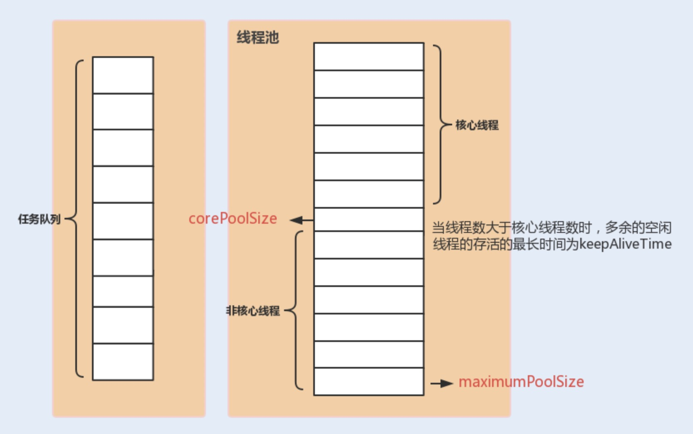
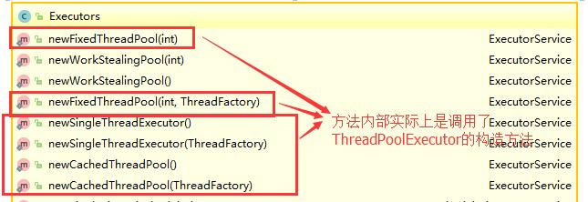

# Java线程池

### 一，使用线程池的好处

池化技术的思想就是减少每次获取资源的消耗，提高对资源的利用率。

线程池提供了一种限制和管理资源(包括执行一个任务)。每个线程池还维护一些基本统计信息，例如已完成任务的数量。其好处如下：

- **降低资源消耗**：通过重复利用已创建的线程降低线程创建和销毁造成的消耗。
- **提高响应速度：**当任务到达时，任务可以不需要等到线程创建就能执行。
- **提高线程的可管理性：**线程是稀缺资源，如果无限制的创建，不仅会消耗系统资源，还会降低系统的稳定性，使用线程池可以进行统一的分配，调优和监控。

### 二，Executor框架

#### 2.1，简介

Executor框架是`Java5`之后引进的，在Java 5之后，通过Executor来启动线程比使用Thread的start方法更好，除了更易管理，效率更好(用线程池实现，节约开销)外，还有助于避免this逃逸问题。

this逃逸是指在构造函数返回之前其他线程就持有该对象的引用，调用尚未构造完全的对象的方法可能引发令人疑惑的问题。

Executor框架不仅包括了线程池的管理，还提供了线程工厂，队列以及拒绝策略等，简化了并发编程的难度。

#### 2.2，Executor框架结构(三大部分组成)

1. **任务**

   执行任务需要实现的Runnable接口或Callable接口，它们的实现类都可以被`ThreadPoolExecutor`或`ScheduledThreadPoolExecutor`执行。

2. **任务的执行**

   如下图所示，包括任务执行机制的核心接口Executor，以及继承Executor接口的`ExecutorService`接口。`ThreadPoolExecutor`或`ScheduledThreadPoolExecutor`这两个关键类实现了`ExecutorService`接口。

   **在实际开发中，我们需要关注`ThreadPoolExecutor`类。**

   

3. **异步计算的结果(Future)**

   Future接口以及Future接口的实现类`FutureTask`类都可以代表异步计算的结果。

   当我们把Runnable接口或Callable接口的实现类提交给`ThreadPoolExecutor`或`ScheduledThreadPoolExecutor`执行。(调用submit()方法时会返回一个`FutureTask`对象)

#### 2.3，Executor框架的使用示意图


1. **主线程首先要创建实现Runnable或者Callable接口的任务对象。**

2. **把创建完成的实现Runnable/Callable接口的对象直接交给`ExecutorService`执行。**

   `ExecutorService.execute（Runnable command）`）或者也可以把 `Runnable` 对象或`Callable` 对象提交给 `ExecutorService` 执行（`ExecutorService.submit（Runnable task）`或 `ExecutorService.submit（Callable  task）`）。

3. **如果执行`ExecutorService.submit（…）`，`ExecutorService`将返回一个实现Future接口的对象**。`submit()`会返回一个 `FutureTask 对象）。由于 FutureTask` 实现了 `Runnable`，我们也可以创建 `FutureTask`，然后直接交给 `ExecutorService` 执行

4. **最后，主线程可以执行`FutureTask.get()`方法来等待任务执行完成。主线程也可以执行`FutureTask.cancel（boolean mayInterruptIfRunning）`来取消此任务的执行。**

### 三，(重要)`ThreadPoolExecutor`类简单介绍

**线程池实现类`ThreadPoolExecutor`是Executor框架最核心的类。**

#### 3.1，`ThreadPoolExecutor`类分析

`ThreadPoolExecutor`类中提供四个构造方法。我们来看最长的那个，其余三个都是在这个构造方法的基础上产生（其他几个构造方法说白点都是给定某些默认参数的构造方法比如默认制定拒绝策略是什么）。

```java
// 用给定的初始参数创建一个新的ThreadPoolExecutor
public ThreadPoolExecutor(int corePoolSize,//线程池的核心线程数量
                          int maximumPoolSize,//线程池的最大线程数
                          long keepAliveTime,//当线程数大于核心线程数时，多余的空闲线程存活的最长时间
                          TimeUnit unit,//时间单位
                          BlockingQueue<Runnable> workQueue,//任务队列，用来储存等待执行任务的队列
                          ThreadFactory threadFactory,//线程工厂，用来创建线程，一般默认即可
                          RejectedExecutionHandler handler//拒绝策略，当提交的任务过多而不能及时处理时，我们可以定制策略来处理任务
                         ) {
    if (corePoolSize < 0 ||
        maximumPoolSize <= 0 ||
        maximumPoolSize < corePoolSize ||
        keepAliveTime < 0)
        throw new IllegalArgumentException();
    if (workQueue == null || threadFactory == null || handler == null)
        throw new NullPointerException();
    this.corePoolSize = corePoolSize;
    this.maximumPoolSize = maximumPoolSize;
    this.workQueue = workQueue;
    this.keepAliveTime = unit.toNanos(keepAliveTime);
    this.threadFactory = threadFactory;
    this.handler = handler;
}
```

**`ThreadPoolExecutor`三个最重要的参数：**

- `corePoolSize`：核心线程数，它定义了最小可以同时运行的线程数量。
- `maximumPoolSize`：当队列中存放的任务达到队列容量时，当前可以同时运行的线程数量的最大数量。
- `workQueue`：当新任务来的时候会先判断当前运行的线程数量是否达到核心线程数，如果达到的话，线程就会被存放在队列中。

`ThreadPoolExecutor`其他常见参数:

1. `keepAliveTime`:当线程池中的线程数量大于 `corePoolSize` 的时候，如果这时没有新的任务提交，核心线程外的线程不会立即销毁，而是会等待，直到等待的时间超过了 `keepAliveTime`才会被回收销毁；
2. `unit` : `keepAliveTime` 参数的时间单位。
3. `threadFactory` :executor 创建新线程的时候会用到。
4. `handler` :饱和策略。详细见下文。

线程池中各个参数的相互关系



**`ThreadPoolExecutor`饱和策略定义**

如果同时运行的线程数量达到最大线程数量并且队列也已经被放满时，`ThreadPoolExecutor`定义的一些策略：

- `ThreadPoolExecutor.AbortPolicy`：抛出`RejectedExecutionException`来拒绝新任务的处理。
- `ThreadPoolExecutor.CallerRunsPolicy`：调用执行自己的线程运行任务，也就是直接在调用execute()方法的线程中运行被拒绝的任务，如果执行程序已关闭，则会丢弃该任务。因此这种策略会降低对于新任务提交速度，影响程序的整体性能。另外，这个策略能够增加队列容量。如果设计的应用程序可以承受此延迟并且你不能丢弃任何一个任务请求的话，可以选择该策略。
- `ThreadPoolExecutor.DiscardPolicy`：不处理新任务，直接丢弃掉。
- `ThreadPoolExecutor.DiscardOldestPolicy`：此策略将丢弃最早未处理的任务请求。

例如：Spring 通过 `ThreadPoolTaskExecutor` 或者我们直接通过 `ThreadPoolExecutor` 的构造函数创建线程池的时候，当我们不指定 `RejectedExecutionHandler` 饱和策略的话来配置线程池的时候默认使用的是 `ThreadPoolExecutor.AbortPolicy`。在默认情况下，`ThreadPoolExecutor` 将抛出 `RejectedExecutionException` 来拒绝新来的任务 ，这代表你将丢失对这个任务的处理。 对于可伸缩的应用程序，建议使用 `ThreadPoolExecutor.CallerRunsPolicy`。当最大池被填满时，此策略为我们提供可伸缩队列。

#### 3.2，推荐使用`ThreadPoolExecutor` 构造函数创建线程池

**线程资源应该通过线程池提供，不允许在应用中自行显示创建线程。建议线程池不使用Executors来创建，而是通过`ThreadPoolExecutor`构造函数的方式，这样的处理方式让写的同学更加明确线程池的运行规则，规避资源耗尽的风险。**

使用线程池的好处是减少在创建和销毁线程上所消耗的时间以及系统资源开销，解决资源不足的问题。如果不使用线程池，有可能会造成系统创建大量同类线程而导致消耗完内存或者“过度切换”的问题。

Executor返回线程池的缺点：

- `FixedThreadPool`和`SingleThreadExecutor`：允许请求的队列长度为`integer.MAX_VALUE`,可能堆积大量的请求，从而导致`OOM`。
- `CachedThreadPool`和`ScheduledThreadPool`：允许创建的线程数量为`integer.MAX_VALUE`，可能会创建大量线程从而导致`OOM`。

**方式一：通过`ThreadPoolExecutor`构造函数实现(推荐)。**


**方式二：通过Executor框架的工具Executors来实现**我们可以创建三种类型的`ThreadPoolExecutor`：

- `FixedThreadPool`。
- `SingleThreadExecutor`。
- `CachedThreadPool`。

对应Executor工具类的方法如图所示：



### 四，(重要)`ThreadPoolExecutor`使用示例

#### 4.1，示例代码：`Runnable` + `ThreadPoolExecutor`

```java
//  这是一个简单的Runnable类，需要大约5秒钟来执行其任务。
class MyRunnable1 implements Runnable{

    private String command;

    public MyRunnable1(String s){
        this.command = s;
    }

    @Override
    public void run() {
        System.out.println(Thread.currentThread().getName() + " 开始时间：" + new Date());
        ProcessCommand();
        System.out.println(Thread.currentThread().getName() + " 结束时间：" + new Date());
    }

    public void ProcessCommand(){
        try {
            Thread.sleep(5000);
        } catch (InterruptedException e) {
            e.printStackTrace();
        }
    }

    @Override
    public String toString() {
        return this.command;
    }
}

public class ThreadPoolExecutorDemo {

    private static final int CORE_POOL_SIZE = 5;
    private static final int MAX_POOL_SIZE = 10;
    private static final int QUEUE_CAPACITY = 100;
    private static final Long KEEP_ALIVE_TIME = 1L;
    public static void main(String[] args) {
        // 通过ThreadPoolExecutor构造函数自定义参数创建
        ThreadPoolExecutor executor = new ThreadPoolExecutor(
                CORE_POOL_SIZE,
                MAX_POOL_SIZE,
                KEEP_ALIVE_TIME,
                TimeUnit.SECONDS,
                new ArrayBlockingQueue<>(QUEUE_CAPACITY),
                new ThreadPoolExecutor.CallerRunsPolicy());

        for (int i = 0; i < 10; i++){
            // 创建Worker对象（WorkerThread类实现了Runnable 接口）
            Runnable worker = new MyRunnable1("" + i);
            // 执行Runnable
            executor.execute(worker);
        }
        // 终止线程池
        executor.shutdown();
        while (!executor.isTerminated()){
        }
        System.out.println("所有线程执行完毕");
    }

}
```

运行结果：

```java
pool-1-thread-2 开始时间：Wed Mar 18 20:15:14 CST 2020
pool-1-thread-3 开始时间：Wed Mar 18 20:15:14 CST 2020
pool-1-thread-5 开始时间：Wed Mar 18 20:15:14 CST 2020
pool-1-thread-1 开始时间：Wed Mar 18 20:15:14 CST 2020
pool-1-thread-4 开始时间：Wed Mar 18 20:15:14 CST 2020
pool-1-thread-2 结束时间：Wed Mar 18 20:15:19 CST 2020
pool-1-thread-3 结束时间：Wed Mar 18 20:15:19 CST 2020
pool-1-thread-3 开始时间：Wed Mar 18 20:15:19 CST 2020
pool-1-thread-2 开始时间：Wed Mar 18 20:15:19 CST 2020
pool-1-thread-5 结束时间：Wed Mar 18 20:15:19 CST 2020
pool-1-thread-5 开始时间：Wed Mar 18 20:15:19 CST 2020
pool-1-thread-1 结束时间：Wed Mar 18 20:15:19 CST 2020
pool-1-thread-1 开始时间：Wed Mar 18 20:15:19 CST 2020
pool-1-thread-4 结束时间：Wed Mar 18 20:15:19 CST 2020
pool-1-thread-4 开始时间：Wed Mar 18 20:15:19 CST 2020
pool-1-thread-3 结束时间：Wed Mar 18 20:15:24 CST 2020
pool-1-thread-5 结束时间：Wed Mar 18 20:15:24 CST 2020
pool-1-thread-2 结束时间：Wed Mar 18 20:15:24 CST 2020
pool-1-thread-4 结束时间：Wed Mar 18 20:15:24 CST 2020
pool-1-thread-1 结束时间：Wed Mar 18 20:15:24 CST 2020
所有线程执行完毕
```

上面代码指定了：

1. `CORE_POOL_SIZE`：核心线程数为5。
2. `MAX_POOL_SIZE`：最大线程数10。
3. `KEEP_ALIVE_TIME`：等待时间为`1L`。
4. `TimeUnit`：等待时间的单位为`TimeUnit.SECONDS`。
5. `workQueue`：任务队列为 `ArrayBlockingQueue`，并且容量为 100;
6. `handler`：饱和策略为`CallerRunsPolicy`。

#### 4.2，线程池原理分析

**线程池每次会同时执行5个任务，这五个任务执行完之后，剩余的5个任务才会被执行。**

**execute()源码：**

```java
// 存放线程池的运行状态 (runState) 和线程池内有效线程的数量 (workerCount)
private final AtomicInteger ctl = new AtomicInteger(ctlOf(RUNNING, 0));

private static int workerCountOf(int c) {
    return c & CAPACITY;
}

private final BlockingQueue<Runnable> workQueue;

public void execute(Runnable command) {
    // 如果任务为null，则抛出异常。
    if (command == null)
        throw new NullPointerException();
    // ctl 中保存的线程池当前的一些状态信息
    int c = ctl.get();

    //  下面会涉及到 3 步 操作
    // 1.首先判断当前线程池中之行的任务数量是否小于 corePoolSize
    // 如果小于的话，通过addWorker(command, true)新建一个线程，并将任务(command)添加到该线程中；然后，启动该线程从而执行任务。
    if (workerCountOf(c) < corePoolSize) {
        if (addWorker(command, true))
            return;
        c = ctl.get();
    }
    // 2.如果当前之行的任务数量大于等于 corePoolSize 的时候就会走到这里
    // 通过 isRunning 方法判断线程池状态，线程池处于 RUNNING 状态才会被并且队列可以加入任务，该任务才会被加入进去
    if (isRunning(c) && workQueue.offer(command)) {
        int recheck = ctl.get();
        // 再次获取线程池状态，如果线程池状态不是 RUNNING 状态就需要从任务队列中移除任务，并尝试判断线程是否全部执行完毕。同时执行拒绝策略。
        if (!isRunning(recheck) && remove(command))
            reject(command);
        // 如果当前线程池为空就新创建一个线程并执行。
        else if (workerCountOf(recheck) == 0)
            addWorker(null, false);
    }
    //3. 通过addWorker(command, false)新建一个线程，并将任务(command)添加到该线程中；然后，启动该线程从而执行任务。
    //如果addWorker(command, false)执行失败，则通过reject()执行相应的拒绝策略的内容。
    else if (!addWorker(command, false))
        reject(command);
}
```


#### 4.3，几个常见对比

##### 4.3.1，Runnable与Callable

Runnable不会返回结果或抛出检查异常，Callable可以，如果任务不想要返回结果或者抛出异常推荐使用Runnable接口。

工具类Executor可以实现Runnable对象和Callable对象之间的互相转化(`Executors.callable(Runnable task)` 或`Executors.callable(Runnable task, Object resule)`)。

```java
@FunctionalInterface
public interface Runnable {
   /**
    * 被线程执行，没有返回值也无法抛出异常
    */
    public abstract void run();
}
```

```java
@FunctionalInterface
public interface Callable<V> {
    /**
     * 计算结果，或在无法这样做时抛出异常。
     * @return 计算得出的结果
     * @throws 如果无法计算结果，则抛出异常
     */
    V call() throws Exception;
}
```

##### 4.3.2，execute()与submit()

1. **execute()方法用于提交不需要返回值的任务，所以无法判断任务是否被线程池执行成功与否。**
2. **submit()方法用于提交需要返回值的任务。线程池会返回一个Future类型的对象，通过这个Future类型对象，通过这个Future对象可以判断任务是否成功执行**，并且可通过Future的get()方法来获取返回值，get()方法会阻塞当前线程直到任务完成，而使用`get(long timeout, TimeUnit unit)`方法则会阻塞当前线程一段时间后立即返回，这是有可能任务没有执行完

我们以**`AbstractExecutorService`**接口中的一个 `submit` 方法为例子来看看源代码：

```java
public Future<?> submit(Runnable task) {
    if (task == null) throw new NullPointerException();
    RunnableFuture<Void> ftask = newTaskFor(task, null);
    execute(ftask);
    return ftask;
}
```

上面方法调用的 `newTaskFor` 方法返回了一个 `FutureTask` 对象。

```java
protected <T> RunnableFuture<T> newTaskFor(Runnable runnable, T value){
    return new FutureTask<T>(runnable, value);
}
```

我们再来看看`execute()`方法：

见上。

##### 4.3.3，`shutdown()`与`shutdownNow()`

- `shutdown()`：关闭线程池，线程池状态变为SHUTDOWN。线程池不再接受新任务了，但是队列里的任务得执行完毕。
- `shutdownNow()`：关闭线程池，线程的状态会变为STOP。线程池会终止当前正在运行的任务，并停止处理排队的任务并返回正在等待执行的List。

##### 4.3.4，`isTerminated()`与`isShutdown`()`

- `isTerminated()`：当调用shutdown()方法后，并且所有提交的任务完成后返回为true。
- `isShutdown()`：调用shutdown()方法后返回true。

#### 4.4，示例代码：`Callable` + `ThreadPoolExecutor`

```java
class MyCallable implements Callable<String>{

    @Override
    public String call() throws Exception {
        Thread.sleep(5000);
        return Thread.currentThread().getName();
    }
}

public class CallableDemo {

    private static final int CORE_POOL_SIZE = 5;//核心线程数
    private static final int MAX_POOL_SIZE = 10;//最大线程数
    private static final int QUEUE_CAPACITY = 100;//任务队列容量为 100;
    private static final Long KEEP_ALIVE_TIME = 1L;//等待时间为1L
    public static void main(String[] args) {
        // 通过ThreadPoolExecutor构造函数自定义参数创建
        ThreadPoolExecutor executor = new ThreadPoolExecutor(
                CORE_POOL_SIZE,
                MAX_POOL_SIZE,
                KEEP_ALIVE_TIME,
                TimeUnit.SECONDS,//等待时间的单位为 TimeUnit.SECONDS。
                new ArrayBlockingQueue<>(QUEUE_CAPACITY),
                new ThreadPoolExecutor.CallerRunsPolicy());

        Callable<String> callable = new MyCallable();
        List<Future> futureList = new ArrayList<>();
        for (int i = 0; i < 10; i++){
            // 提交任务到线程池
            Future<String> future = executor.submit(callable);
            // 将返回的结果添加到list里面
            futureList.add(future);
        }
        for (Future<String> future : futureList){
            try {
                System.out.println(future.get() + " :: " + new Date());
            } catch (InterruptedException e) {
                e.printStackTrace();
            } catch (ExecutionException e) {
                e.printStackTrace();
            }
        }
        // 关闭线程池
        executor.shutdown();
        System.out.println("所有线程执行完毕");
    }
}
```

运行结果：

```java
pool-1-thread-1 :: Wed Mar 18 21:59:47 CST 2020
pool-1-thread-2 :: Wed Mar 18 21:59:47 CST 2020
pool-1-thread-3 :: Wed Mar 18 21:59:47 CST 2020
pool-1-thread-4 :: Wed Mar 18 21:59:47 CST 2020
pool-1-thread-5 :: Wed Mar 18 21:59:47 CST 2020
pool-1-thread-4 :: Wed Mar 18 21:59:52 CST 2020
pool-1-thread-1 :: Wed Mar 18 21:59:52 CST 2020
pool-1-thread-5 :: Wed Mar 18 21:59:52 CST 2020
pool-1-thread-3 :: Wed Mar 18 21:59:52 CST 2020
pool-1-thread-2 :: Wed Mar 18 21:59:52 CST 2020
所有线程执行完毕
```

### 五，几种常见的线程池详解

